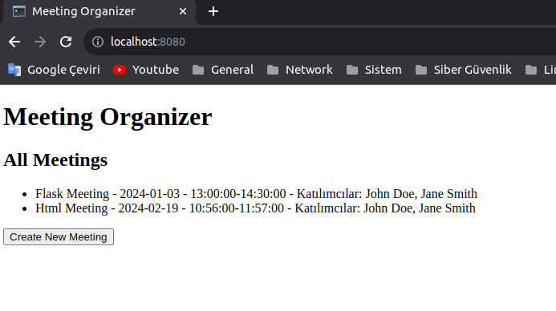

# Meeting Organizer:

Server-Client mantığında çalışan ve toplantılarını kontrol edecebileceği bir sistemdir.

## :hammer_and_wrench: Installation

Clone Repo:

```
git clone https://github.com/alvarobartt/investpy.git
```

Create Venv:

```
python -m venv venv_name
```

Activate Venv:

```
source venv_name/bin/activate
```

Go to Project Directory:

```
cd meeting-organizer
```

Install Dependencies:

```
pip install -r requirements.txt
```

Run Project:

```
python app.py
```

## :computer: Usage



Meeting Organizer anasayfa ksımında tüm toplantıların listelendiği bir arayüz bulacaksınız eğer herhangi bir toplantı yoksa burası boş gelecektir. Altında bulunan Create New Meeting butonuna tıklayarak yeni bir toplantı oluşturabilirsiniz. Ayrıca oluşturulan toplantıların iptali durumunda veya alanları hakkında herhangi bir değişiklik yapmanız gerektiğinde olan toplantılardan hangisi üzerinde değişiklik yapmak isterseniz üzerine tıklayın bu sayede bu verileri güncelleyebileceğiniz veya tamamen silebileceğiniz bir form açılacaktır.
